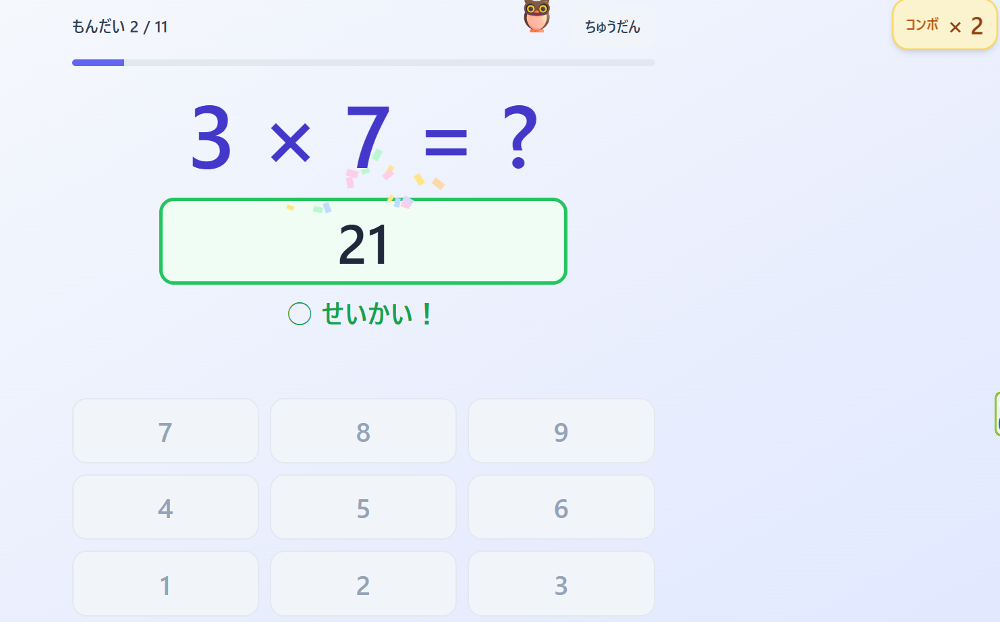
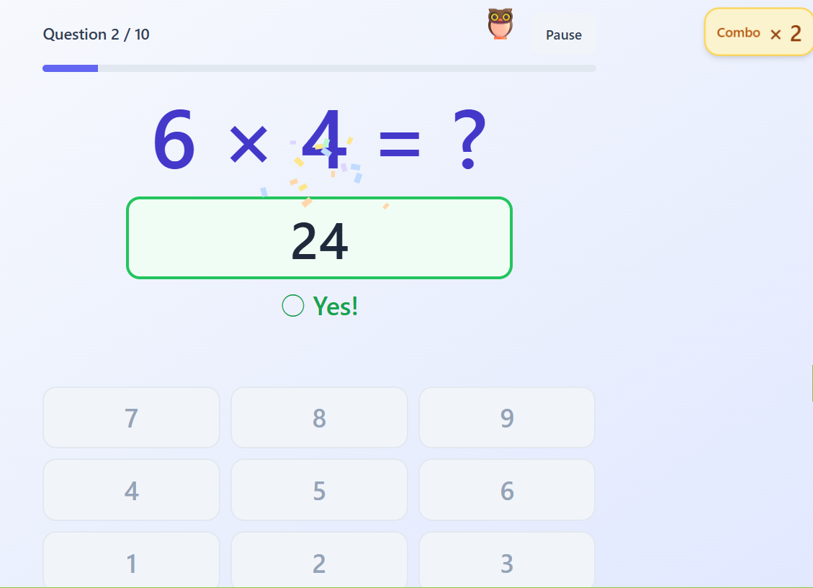

# 🎯 kuku-dojo（九九どうじょう） / kuku-dojo (Multiplication Tables Dojo)

[](LICENSE)
[](#-特徴--features)
[](#-ダウンロード--download)
[](package.json)
[](.github/workflows/test.yml)
[](#-特徴--features)

小学2〜3年生向け、**単一 HTML ファイルで動くオフライン九九練習アプリ**。
苦手な問題を自動で重点出題する**適応型学習アルゴリズム**と、
子供が楽しく続けられる**カラフルなエフェクト**を搭載。

> 🌐 **English**: An offline multiplication tables practice web app for elementary school children (grades 2–3, ages 7–9). Comes as a **single HTML file** with an **adaptive learning algorithm** that focuses on the problems your child struggles with, plus child-friendly visual effects to keep practice fun. UI available in 6 languages (Japanese, English, Simplified/Traditional Chinese, Korean, Vietnamese).





---

## 📥 ダウンロード / Download

最新版の `kuku-dojo.html` は [Releases](../../releases) から入手できます。
ファイルをダウンロードしてダブルクリックするだけで起動します。インストール不要・オフライン動作。

> 🌐 **English**: Download the latest `kuku-dojo.html` from [Releases](../../releases). Just double-click the file to launch it in your browser. No installation needed — runs completely offline once downloaded.

---

## ✨ 特徴 / Features

- 📦 **単一 HTML ファイル** — ダウンロードしてダブルクリックするだけで起動  
  **Single HTML file** — Just download and double-click to launch
- 🌐 **完全オフライン** — サーバー・インターネット不要、個人情報も外部送信なし  
  **Fully offline** — No server or internet required; no personal data is ever sent externally
- 🧠 **適応型出題** — 間違えた問題ほど出やすくなる（重み付き抽選）  
  **Adaptive practice** — Problems your child gets wrong appear more often (weighted random selection)
- 👨‍👩‍👧 **マルチアカウント** — 兄弟・友達で 1 台を共有 OK  
  **Multi-account** — Siblings or friends can share a single device with separate profiles
- 🎉 **子供向けエフェクト** — 紙吹雪・マスコット・効果音・コンボ演出  
  **Child-friendly effects** — Confetti, mascot, sound effects, and combo celebrations
- 📊 **成績ダッシュボード** — 段別正答率・習熟度マップ・苦手ワースト 5  
  **Progress dashboard** — Accuracy by table, skill map, and top 5 tricky problems
- ⏱️ **がんばった きろく** — 問題ごとの回答時間を可視化、「じかんもくひょう」4 プリセット (15s / 10s / 7s / 5s) で自分のペースを選べる  
  **Time log** — Visualizes per-problem answer time, with 4 selectable speed presets (15s / 10s / 7s / 5s) so the child picks their own pace
- 🌐 **多言語対応 (Languages: ja / en / zh-CN / zh-TW / ko / vi)** — ブラウザ言語を自動判定、せっていから手動切替も可能。最後に選んだ言語はログアウト後の Login 画面でも復元される（v1.3.0 で初期 6 言語フル展開 / Phase D で es / pt-BR を追加予定）。**zh-CN / zh-TW / ko / vi は機械翻訳ベース**で、ネイティブによる訳語の改善提案を [Issues #1](https://github.com/fk506cni/kuku-dojo/issues/1) で歓迎しています。**新しい対応言語のご要望も [Issues](https://github.com/fk506cni/kuku-dojo/issues) から気軽にお寄せください — 需要に応じて適宜検討します**  
  **Multilingual UI (ja / en / zh-CN / zh-TW / ko / vi)** — Auto-detected from browser locale; manual switch available in Settings. Your last choice is restored even on the Login screen. Currently 6 languages (added in v1.3.0); Spanish and Brazilian Portuguese planned for Phase D. The 4 non-Japanese-non-English translations are **machine-translation–based** — native-speaker improvements are very welcome at [Issues #1](https://github.com/fk506cni/kuku-dojo/issues/1). **Requests for new languages are also welcome via [Issues](https://github.com/fk506cni/kuku-dojo/issues) — we'll consider them as demand arises**
- 🦻 **やさしい UI** — 大きな文字とボタン、ひらがな主体、色覚多様性に配慮  
  **Accessible UI** — Large text and buttons, hiragana-primary (Japanese) writing, color-blindness considerate

---

## 🚀 使い方（利用者向け） / How to Use (for end users)

1. `dist/kuku-dojo.html` をダブルクリックしてブラウザで開く
2. 「あたらしくつくる」からなまえを入力
3. ホーム画面で段と問題数を選び「はじめる」
4. 問題に答えると、苦手な問題がだんだん多く出るようになります

> 🌐 **English**:
> 1. Double-click `dist/kuku-dojo.html` to open it in your browser
> 2. Tap **"あたらしくつくる" / "+ Make new"** to create a profile and enter a name
> 3. On the Home screen, pick which times tables (段) and how many questions to practice, then tap **"はじめる" / "Start"**
> 4. As your child answers, the app gradually shows more of the problems they struggle with

配布版 `dist/kuku-dojo.html` は**完全オフライン**で動作します。インターネット接続は一切不要、すべてのファイル（React / Tailwind / アプリ本体）が 1 つの HTML に埋め込まれています。

> 🌐 **English**: The distributed `dist/kuku-dojo.html` runs **fully offline**. No internet connection is needed at any point — React, Tailwind, and the app itself are all bundled into a single HTML file.

> ℹ️ **成績データの保管場所**: 成績データはこのブラウザの localStorage に保存されます。ブラウザのデータを消去すると成績もリセットされる点にご注意ください。  
> 🌐 **Where progress is stored**: All progress data is saved in the browser's localStorage. Clearing browser data will reset the records, so please be aware of this.

> 📱 **Safari をご利用の場合**: Safari は `file://` で開いたページの localStorage をブラウザによって制限する場合があります。成績が保存されない場合は、下記「開発者向け」の `python3 -m http.server 8000` を使った起動を試してください。  
> 🌐 **For Safari users**: Safari may restrict localStorage on pages opened via `file://`. If progress isn't being saved, try the `python3 -m http.server 8000` workaround described in the developer section below.

---

## 🧑‍💻 開発者向け / For Developers

> 🌐 **English overview**: This section is for developers who want to build the distributed file from source, run unit tests, or modify the app. End users only need the prebuilt `dist/kuku-dojo.html` from Releases.

### 必要なもの / Requirements

- モダンブラウザ（Chrome / Edge / Firefox / Safari の最新版）  
  Modern browser (latest Chrome / Edge / Firefox / Safari)
- **配布版ビルド / ユニットテスト実行時** Node.js **22+**（`package.json` の `engines` で宣言 / `--test-reporter=spec` と native glob の要件）  
  **For building dist / running unit tests**: Node.js **22+** (declared in `package.json` `engines`; required by `--test-reporter=spec` and native glob)
- 開発版 `index.html` を直接編集する場合は、初回起動時のみインターネット接続（Play CDN から React / Tailwind を読み込むため）  
  When editing the dev version `index.html` directly, internet is needed on first load (to fetch React / Tailwind from Play CDN)
- （任意）簡易 HTTP サーバー: `python3 -m http.server 8000`  
  (Optional) Lightweight HTTP server: `python3 -m http.server 8000`
- 動作確認 OS: Linux / macOS（Windows のテストは未対応 / `package.json` の glob パターンが shell 挙動に依存）  
  Verified on Linux / macOS (Windows is not currently tested; the `package.json` glob patterns depend on shell behavior)

### ディレクトリ構成 / Directory Layout

```
kuku-dojo/
├── index.html                           # 開発版 / Dev build (CDN-based, editable)
├── dist/
│   └── kuku-dojo.html                   # 配布版 / Distribution build (fully inlined)
├── scripts/
│   └── build-dist.mjs                   # 配布版ビルド / Distribution build script
├── package.json                         # Node 依存とビルドコマンド / Node deps & commands
├── CLAUDE.md                            # AI アシスタント向けコンテキスト / AI assistant context
├── SPEC.md                              # 技術仕様書 / Technical spec
├── README.md                            # 本ファイル / This file
├── prompts.md                           # ステップ別実装プロンプト / Step-by-step prompts
└── docs/
    ├── startNN.md / reportNN.md         # 敵対的レビュー記録 / Adversarial review logs (gitignored)
    └── __archives/                      # 過去版 / Archived (gitignored)
```

> `dist/` は `.gitignore` 済み。配布物は GitHub Releases 等で別途公開する運用を想定。  
> 🌐 **English**: `dist/` is gitignored — distribution artifacts are published separately via GitHub Releases.

### 技術スタック（開発版 / 配布版） / Tech Stack (Dev / Distribution)

| 用途 / Purpose | 開発版 (`index.html`) / Dev | 配布版 (`dist/kuku-dojo.html`) / Distribution |
|------|------|------|
| UI | React 18 (JSX) + Babel Standalone | React 18 production min + pre-compiled by Babel CLI |
| スタイル / Styling | Tailwind CSS (Play CDN, JIT) | Tailwind CLI で使用クラスのみ抽出 / Inlined CSS extracted via Tailwind CLI |
| 永続化 / Persistence | localStorage | 同左 / same |
| エフェクト / Effects | Canvas + CSS Animation | 同左 / same |
| サウンド / Sound | Web Audio API (OscillatorNode) | 同左 / same |

配布版は実行時 JSX 変換・外部 fetch を一切行わないため、起動が高速でネットワーク不要です。

> 🌐 **English**: The distribution build performs no runtime JSX transformation and no external fetches, so startup is fast and works without a network connection.

詳細は [SPEC.md](SPEC.md) §1.1 と §7 を参照。 / See [SPEC.md](SPEC.md) §1.1 and §7 for full details.

### 配布版のビルド / Building the Distribution

```bash
npm install                # 初回のみ / first time only
npm run build              # → dist/kuku-dojo.html を生成 / generates dist/kuku-dojo.html
```

ビルドスクリプトは `scripts/build-dist.mjs` にあり、おおよそ次の処理を行います:

1. `npx tailwindcss` で `index.html` 内の使用クラスを抽出し、minify した CSS を生成
2. `index.html` 内の `<script type="text/babel">` を抜き出し、`@babel/preset-react` で JSX を JS に事前コンパイル
3. `node_modules` から `react.production.min.js` / `react-dom.production.min.js` をコピー
4. 上記 3 つを HTML テンプレートに `<style>` / `<script>` としてインライン埋め込み → `dist/kuku-dojo.html`

> 🌐 **English (build pipeline summary)**:
> 1. Extract used Tailwind classes from `index.html` via `npx tailwindcss` and emit minified CSS
> 2. Extract the `<script type="text/babel">` block from `index.html` and pre-compile JSX → JS using `@babel/preset-react`
> 3. Copy `react.production.min.js` / `react-dom.production.min.js` from `node_modules`
> 4. Inline the three above into the HTML template as `<style>` / `<script>` and emit `dist/kuku-dojo.html`

### 実装の進め方 / Implementation Workflow

[prompts.md](prompts.md) にステップ別の実装プロンプトとチェックリストをまとめています。
順に実行していけば段階的にアプリが完成します。Step 10 で配布版のビルドと最終テストを行います。

> 🌐 **English**: [prompts.md](prompts.md) contains step-by-step implementation prompts and checklists. Following them in order builds the app incrementally; Step 10 covers distribution build and final testing.

### 起動時間ベースライン / Startup Time Baseline

退行検知のため各 Step 完了時点の起動時間を記録します。計測指標と手順の詳細は [SPEC.md §6.1.1](SPEC.md) を参照。

> 🌐 **English**: Startup times are recorded at each Step completion to detect regressions. See [SPEC.md §6.1.1](SPEC.md) for measurement details.

本アプリは 2 つの指標を同時にログ出力します:

- **`js`**: `<script type="text/babel">` 先頭 → App マウントの区間（Babel 変換 + React 初回レンダ）。**headless Chrome でも安定**するため自動退行検知の主指標  
  Span from the start of `<script type="text/babel">` to App mount (Babel transform + React initial render). **Stable under headless Chrome** — used as the primary regression-detection metric
- **`total`**: navigationStart → App マウントの全区間（HTML/CDN ダウンロード含む）。SPEC.md §6.1 の「5 秒以内」目標に対応。**実ブラウザで計測する必要あり**（headless では Chrome プロセスのオーバーヘッドで 15〜25 秒水増しされる）  
  navigationStart → App mount, including HTML/CDN download (the "within 5 sec" goal in SPEC.md §6.1). **Must be measured in a real browser** — under headless Chrome, process overhead inflates the value by 15–25 seconds

**計測方法 / How to Measure**:

1. **自動計測（js のみ / 退行検知用） / Automated (js only, for regression detection)**:
   ```bash
   ./scripts/measure_startup.sh --runs 3
   ```
   headless Chrome で 3 回計測し、`js` 値の統計を出力します。 / Runs 3 measurements in headless Chrome and prints `js` statistics.

2. **実ブラウザ計測（total を含む本物のベースライン） / Real browser (genuine baseline including total)**:
   - 開発版 `index.html` を通常の Chrome/Edge/Firefox でダブルクリック起動 / Open dev `index.html` in a normal Chrome/Edge/Firefox
   - DevTools（F12）> Console タブを開く / Open DevTools (F12) → Console
   - `[kuku-dojo] startup: total=XXXms js=XXXms` のログを読む / Read the log line
   - シークレットウィンドウで開くと「初回」、同じウィンドウで F5 すると「2 回目以降」の値が得られる / Incognito = "first run", same window + F5 = "subsequent runs"

**ベースライン表 / Baseline Table**:

| Step | 計測日 / Date | 開発版 `js` (ms) | 開発版 `total` 初回 (ms) | 開発版 `total` 2 回目 (ms) | 配布版 `js` (ms) | 配布版 `total` (ms) | 備考 / Notes |
|------|--------|------------------|--------------------------|----------------------------|------------------|---------------------|------|
| Step 0（足場補完後） / Step 0 (scaffold complete) | 2026-04-15 | **6** ✅ (automated) | 実ブラウザで手動計測 / measured manually | 実ブラウザで手動計測 / measured manually | — | — | `useHash` + 5 placeholder screens. `scripts/measure_startup.sh` 3 runs converged on `js=6,6,6 ms` |
| Step 3 | — | — | — | — | — | — | LoginScreen 実装後 / after LoginScreen |
| Step 5 | — | — | — | — | — | — | QuizScreen 実装後 / after QuizScreen |
| Step 7 | — | — | — | — | — | — | エフェクト統合後 / after effects integration |
| Step 10（配布版ビルド完成） / Step 10 (dist build complete) | 2026-04-18 | **51** ✅ (automated) | 実ブラウザで手動計測 / measured manually | 実ブラウザで手動計測 / measured manually | **32** ✅ (automated) | 実ブラウザで手動計測 / measured manually | Distribution: no runtime Babel, zero external fetch — `js=32ms`/`total=45ms` (headless, no download delay). Dev value is post-feature-complete |

> **目標値 / Target values**:
> - `js`: 開発版 ≤ 1000 ms / dev ≤ 1000 ms; 配布版 ≤ 200 ms / distribution ≤ 200 ms (automated regression detection)
> - `total`: 開発版 初回 ≤ 5000 ms / first dev run ≤ 5000 ms; 2 回目以降 ≤ 3000 ms / subsequent ≤ 3000 ms; 配布版 ≤ 2000 ms / distribution ≤ 2000 ms (real-browser measurement)
>
> **退行検知の基点 / Regression detection baseline** (revised in 11th review C11-18): During Step 0–7 (full feature build-out), `js` naturally grows as features land, so per-Step comparison is not done. Step 10 (distribution build complete) — dev `js=51ms` / dist `js=32ms` — is **the baseline for subsequent regression detection**. Investigate within the same session only when post-Step-11 changes cause a >50% regression.

### 動作確認済みブラウザ / Verified Browsers

| ブラウザ / Browser | `file://` ダブルクリック起動 / Double-click | `http://localhost` 起動 / Localhost serve | 備考 / Notes |
|----------|------------------------------|--------------------------|------|
| Chrome（最新） / Chrome (latest) | ✅ | ✅ | Desktop / Android |
| Edge（最新） / Edge (latest) | ✅ | ✅ | Desktop |
| Firefox（最新） / Firefox (latest) | ✅ | ✅ | Desktop |
| Safari（macOS/iPadOS 最新） / Safari (latest) | ⚠ localStorage が保存されない場合あり / localStorage may not persist | ✅ | iPad でも `http://localhost` 経由起動を推奨 / Recommend `http://localhost` for iPad too |

配布版 `dist/kuku-dojo.html` のファイルサイズは v1.3.0 (Phase C / 6 言語) 時点で約 **426 KB**（React/ReactDOM production min + Tailwind 抽出 CSS + 事前コンパイル済み app.js + MESSAGES 6 言語込み）。1 MB 警告しきい値の約 41%。起動時間は headless Chrome で `total=45ms / js=32ms`、実ブラウザでも SPEC.md §6.1 の目標 2 秒以内を十分に満たします。

> 🌐 **English**: As of v1.3.0 (Phase C / 6 languages), `dist/kuku-dojo.html` is approximately **426 KB** (React/ReactDOM production min + extracted Tailwind CSS + pre-compiled app.js + 6 language MESSAGES bundles), about 41% of the 1 MB warning threshold. Startup time under headless Chrome is `total=45ms / js=32ms`, comfortably meeting the SPEC.md §6.1 target of 2 seconds in real browsers as well.

### 既知の制限事項 / Known Limitations

- **v1.0.0 の実機検証範囲**: v1.0.0 は自動検証（ビルドパイプライン / オフライン性 / 500KB サイズ / 起動時間）と **Windows Chrome / Edge** の実機動作確認を基準として刻印されています。macOS Safari / iPadOS Safari / Firefox / Android タブレット / 色覚シミュレータ / SR 実読み上げについては v1.0.x のパッチで順次検証します（SPEC.md §7.5 リリース基準 / `docs/__archives/report11.md` C11-01）。  
  **v1.0.0 device-verification scope**: v1.0.0 was stamped on the basis of automated checks (build pipeline / offline / 500 KB size / startup time) and real-device verification on **Windows Chrome / Edge**. macOS Safari, iPadOS Safari, Firefox, Android tablets, color-blindness simulators, and real screen-reader playback are being verified incrementally in v1.0.x patches (SPEC.md §7.5 / `docs/__archives/report11.md` C11-01).
- **Safari `file://` の localStorage 制限**: Safari は `file://` で開いたページの localStorage を制限することがあり、成績データが保存されない場合があります。回避策として `python3 -m http.server 8000` で起動し `http://localhost:8000/dist/kuku-dojo.html` を開いてください。  
  **Safari `file://` localStorage restriction**: Safari may restrict localStorage on pages opened from `file://`, in which case progress isn't saved. Workaround: launch `python3 -m http.server 8000` and open `http://localhost:8000/dist/kuku-dojo.html`.
- **ブラウザデータ消去で成績消失**: 成績・設定・アカウント情報は利用者のブラウザ localStorage にのみ保存されます。ブラウザの「閲覧データの削除」や「シークレットモード」利用で全データが消失する点に注意してください。現時点ではデータエクスポート機能はありません（将来拡張予定）。  
  **Clearing browser data wipes progress**: Records, settings, and accounts are stored only in the user's browser localStorage. "Clear browsing data" or Incognito/Private mode will erase all data. There is no data-export feature yet (planned).
- **複数タブ同時起動は保証外**: 同一ブラウザで複数タブを開いた状態での挙動は未定義です。タブ間で state が乖離する可能性があります（SPEC.md §6.3）。  
  **Concurrent tabs not supported**: Behavior with multiple tabs of the app open in the same browser is undefined; state may diverge between tabs (SPEC.md §6.3).
- **iOS Safari のエッジスワイプ back**: 試験中のエッジスワイプ back は確認ダイアログを経由せずに前画面に戻る場合がありますが、未完了セッションは保存されない仕様のため成績喪失以上の被害はありません（SPEC.md §4.3）。  
  **iOS Safari edge-swipe back**: Edge-swipe back during a quiz can return to the previous screen without a confirmation dialog. By design, incomplete sessions are not saved, so no damage beyond losing the in-progress session occurs (SPEC.md §4.3).
- **Tailwind Play CDN 警告（開発版のみ）**: 開発版 `index.html` は Play CDN を使うため `should not be used in production.` の警告が出ますが、配布版 `dist/kuku-dojo.html` では出ません。  
  **Tailwind Play CDN warning (dev only)**: The dev `index.html` uses the Play CDN, which prints a `should not be used in production.` warning. The distribution `dist/kuku-dojo.html` does not.

### 開発版コンソールに出る想定ログ・警告 / Expected Console Logs & Warnings (dev only)

開発版 `index.html` は Play CDN を使う性質上、以下のログが**仕様上必ず**出ます。`error` レベルの出力が無ければ正常です。

> 🌐 **English**: Because dev `index.html` uses the Play CDN, the following logs are **expected by design**. As long as no `error`-level output appears, things are running normally.

- `cdn.tailwindcss.com should not be used in production.` — Tailwind Play CDN の案内（配布版 `dist/kuku-dojo.html` では出ません）  
  Tailwind Play CDN advisory (does not appear in distribution `dist/kuku-dojo.html`)
- `You are running React in development mode...` — React dev build の案内 / React dev build advisory
- `[kuku-dojo] startup: XXX ms` — 本アプリの起動時間計測ログ（info） / This app's startup time log (info level)

---

## 🗺️ 画面構成 / Screen Map

```
[ログイン / Login] → [ホーム / Home] → [試験 / Quiz] → [結果サマリー / Result Summary]
              ↓
          [成績表示 / Stats]
```

- **ログイン / Login**: アカウント選択 / 新規作成 / Account picker and creation
- **ホーム / Home**: 段選択・問題数設定・試験開始・成績表示 / Choose tables, question count, start quiz, view stats
- **試験 / Quiz**: 出題・テンキー入力・フィードバック / Question display, keypad input, feedback
- **結果サマリー / Result Summary**: 正答率・所要時間・間違えた問題 / Accuracy, elapsed time, missed problems
- **成績表示 / Stats**: 履歴一覧・段別正答率・習熟度マップ / History list, accuracy by table, skill map

---

## 🔒 プライバシー / Privacy

- サーバー通信は一切行いません  
  No server communication at any time
- パスワードは不要（ニックネームのみ）  
  No passwords (nickname only)
- 個人を特定する情報は保存しません  
  No personally identifiable information is stored
- すべてのデータは利用者のブラウザ内にのみ保存されます  
  All data lives only inside the user's browser

---

## 🗓️ ロードマップ / Roadmap

v1.1.0 公開後の予定（優先度順、詳細は [SPEC.md §8](SPEC.md) 参照）:

> 🌐 **English**: Plans after v1.1.0 release, in priority order. Full details in [SPEC.md §8](SPEC.md).

- **v1.0.x / v1.1.x パッチ**: macOS Safari / iPadOS Safari / Firefox / Android タブレット等の実機検証を順次反映 + 配布物サイズ予算の見直し（500 KB → 1 MB zip）  
  **v1.0.x / v1.1.x patches**: Roll in incremental real-device verification (macOS Safari / iPadOS Safari / Firefox / Android tablets, etc.) and revise the distribution size budget (500 KB → 1 MB zip)
- ✅ **v1.1.0**（2026-04-22 公開 / released 2026-04-22）: 回答時間の可視化と「じかんもくひょう」機能。Stats 画面の「がんばった きろく」タブで問題ごとの所要時間を可視化、4 プリセット 5〜15 秒（のんびり / ふつう / きびきび / たつじん）を選べる。適応出題アルゴリズム本体は変更なし（SPEC.md §8.8）。**「たつじん 5 秒」はお子さん自身が選ぶ前提のチャレンジ枠で、到達時は可視化のみ・未達でもペナルティは発生しません**（保護者による押し付け防止の設計配慮）  
  Per-problem answer-time visualization and a "time goal" feature in the Stats "Time log" tab, with four presets (15s / 10s / 7s / 5s — relaxed / normal / brisk / master). Core adaptive algorithm unchanged (SPEC.md §8.8). **The "Master 5 sec" preset is intentionally a challenge that the child themselves chooses — reaching it only triggers visualization, and missing it carries no penalty** (designed to prevent parents from imposing speed pressure)
- ✅ **v1.2.0**（2026-04-25 公開 / released 2026-04-25）: 多言語対応 Phase A/B（`navigator.language` による自動判定 + せっていから手動切替）。日英 2 言語に対応、Login 画面の言語復元も実装  
  Multilingual support Phase A/B: auto-detection via `navigator.language` plus manual switch from Settings. Japanese + English (2 languages) with Login-screen language restoration
- ✅ **v1.3.0**（2026-04-25 公開 / released 2026-04-25）: 多言語対応 Phase C（zh-CN / zh-TW / ko / vi の 4 言語追加 — 初期 6 言語フル展開）。zh-HK/zh-MO/zh-SG の region variant + zh-Hans/zh-Hant の script tag フォールバック (Android 中華圏対応) も実装。**4 言語は機械翻訳ベース**で公開し、ネイティブによる改善提案を Issues で募集  
  Multilingual Phase C: 4 added languages (Simplified/Traditional Chinese, Korean, Vietnamese) — initial 6-language full deployment. Region variant fallbacks (zh-HK/zh-MO/zh-SG) and script-tag fallbacks (zh-Hans*/zh-Hant*, for Android Chinese browsers) are also implemented. **The 4 added languages are machine-translation–based**; native improvements are welcomed via Issues
- **v1.4.0 以降 / v1.4.0 and beyond**: 多言語対応 Phase D（es / pt-BR）。需要次第で進める。配布版サイズ予算（SPEC §7.4 の 1 MB zip）内で順次追加予定  
  Multilingual Phase D (Spanish / Brazilian Portuguese), proceeded based on demand, within the 1 MB zip size budget (SPEC §7.4)
- **新言語の追加リクエスト / New language requests**: 上記以外の言語（例: フランス語 / ドイツ語 / インドネシア語 / タイ語など）も [Issues](../../issues) でリクエストいただければ、需要や翻訳協力者の有無を踏まえて適宜検討します  
  Other languages (e.g. French, German, Indonesian, Thai, etc.) can be requested via [Issues](../../issues) — we'll consider them based on demand and the availability of native-speaker collaborators
- **その他 / Other**: 時間減衰 / 全網羅モード / データエクスポート（SPEC.md §8） / Time-decay weighting, exhaustive mode, data export (SPEC.md §8)

要望・フィードバックは [Issues](../../issues) へお気軽にどうぞ。 / Please feel free to send requests and feedback to [Issues](../../issues).

---

## 🤝 貢献・フィードバック / Contributing & Feedback

- バグ報告・要望は [Issues](../../issues) へ  
  Bug reports and feature requests → [Issues](../../issues)
- 翻訳の改善提案も大歓迎です（zh-CN / zh-TW / ko / vi は機械翻訳ベース）。既存の専用 Issue: [Issues #1](https://github.com/fk506cni/kuku-dojo/issues/1)  
  Translation improvements are very welcome (zh-CN / zh-TW / ko / vi are machine-translation–based). Dedicated Issue: [Issues #1](https://github.com/fk506cni/kuku-dojo/issues/1)
- **新しい対応言語のリクエストも歓迎します**。需要や翻訳協力者の有無を踏まえて適宜検討しますので、お気軽に [Issues](../../issues) でお声がけください  
  **Requests for new supported languages are welcome** — we'll consider them based on demand and the availability of native-speaker collaborators. Please feel free to reach out via [Issues](../../issues)
- 小さな修正の PR 歓迎。大きな変更は先に Issue で相談してください  
  Small-fix PRs are welcome. For larger changes, please open an Issue first to discuss
- AI アシスタント (Claude Code) とのペアプログラミングで各 Step ごとに敵対的レビューを挟みながら開発しました。開発フローの詳細は [`SPEC.md`](SPEC.md) / [`prompts.md`](prompts.md) / [`CLAUDE.md`](CLAUDE.md) を参照  
  This project was developed in pair-programming style with the Claude Code AI assistant, with adversarial reviews between each Step. See [`SPEC.md`](SPEC.md) / [`prompts.md`](prompts.md) / [`CLAUDE.md`](CLAUDE.md) for details

---

## ☕ 応援について / Sponsorship

kuku-dojo は個人開発のオフラインアプリで、MIT ライセンスで自由に使えます。
気に入っていただけたら応援 1 杯分のコーヒー代をいただけると嬉しいです（任意です）。

> 🌐 **English**: kuku-dojo is an individually-developed offline app, freely usable under the MIT License. If you enjoy it, a "cup of coffee" sponsorship would be very much appreciated (entirely optional).

- 💖 [GitHub Sponsors](https://github.com/sponsors/fk506cni) — 継続的なサポート / Recurring support
- ☕ [Buy Me a Coffee](https://buymeacoffee.com/fk506cni) — 単発の応援 / One-off support
- 🎁 [OFUSE](https://ofuse.me/fk506cni) — お布施（日本発のサービス、文章付きで送れます） / Japanese-origin service that lets you send a message with the support

リポジトリ右上の **Sponsor** ボタンからもまとめて一覧できます（[`.github/FUNDING.yml`](.github/FUNDING.yml)）。

> 🌐 **English**: All options are also accessible via the **Sponsor** button at the top right of the repository (configured in [`.github/FUNDING.yml`](.github/FUNDING.yml)).

バグ報告や「こどもがこう使っていた」というフィードバックも大歓迎です。

> 🌐 **English**: Bug reports and "here's how my child uses it" stories are also very welcome.

---

## 📜 ライセンス / License

[MIT License](LICENSE) — 自由に利用・改変・再配布できます。著作権表示とライセンス本文を成果物に含めてください。

> 🌐 **English**: [MIT License](LICENSE) — free to use, modify, and redistribute. Please include the copyright notice and the full license text in any derivative works.
